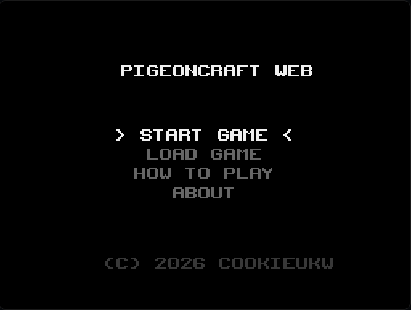
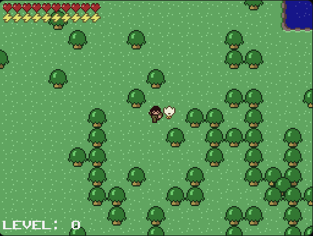
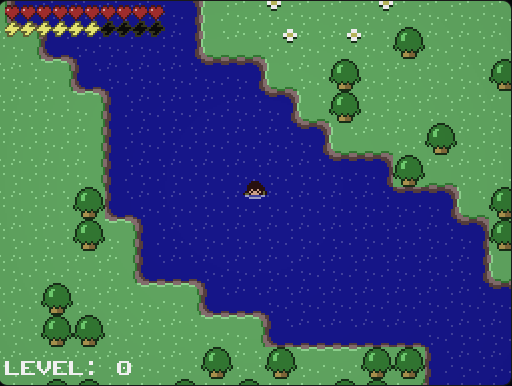

# Pigeoncraft

Welcome to **Pigeoncraft**, a modern JavaScript/Web reimplementation of the classic Java game (originally known as Minicraft).

## 🎮 About The Project
This repository is dedicated to bringing the original, pixel-perfect Java game experience directly to your web browser. No complex dependencies, no Java installations—just pure, lightweight browser execution. While almost all core mechanics are fully playable, please note that this is an ongoing port and you may encounter minor inconsistencies compared to the original Java release.

### ✨ Key Features
*   **Native Canvas Rendering Engine:** A fully rewritten pixel-perfect renderer for HTML5 Canvas.
*   **Mob & Combat Parity:** Features Slimes, Zombies, and Skeletons, along with the newest additions like Sheep, Chickens, and Pigeons.
*   **Full Building & Crafting System:** Craft and place Wood Planks, Wood Walls, Doors, Torches (with flickering effects), Ovens, Anvils, and more.
*   **Underground World & Lighting System:** Explore the deep caves with a fully functional, real-time radial lighting system.

### 🤝 Contributing
This project is largely complete, but you might still find some bugs or missing details. If you'd like to help improve the port or fix an inconsistency, feel free to open an **Issue** or submit a **Pull Request**. Contributions are always welcome!

## 📸 Screenshots

<p align="center">
  
  
  
</p>

### 🚪 The Classic Menu

*The nostalgic title screen, fully reimagined for the web with a pixel-perfect retro interface.*

### 🌍 A Vast World to Explore

*Gather resources, craft tools, and survive against the creatures that lurk in the dark.*

### 🏊‍♂️ Dynamic Interactions

*Fluid mechanics, including swimming, stamina management, and dynamic environments.*

## ⌨️ Controls

*   **Movement:** <kbd>W</kbd> <kbd>A</kbd> <kbd>S</kbd> <kbd>D</kbd> or <kbd>Arrow Keys</kbd>
*   **Attack / Use Item:** <kbd>Space</kbd> or <kbd>V</kbd>
*   **Interact (Doors, Chests, etc.):** <kbd>F</kbd>
*   **Inventory:** <kbd>E</kbd> or <kbd>X</kbd>
*   **Crafting:** <kbd>C</kbd>
*   **Map:** <kbd>M</kbd>

## 🚀 Getting Started

To run the game locally:

1. Install dependencies using pnpm (or npm/yarn):
   ```bash
   pnpm install
   ```
2. Start the development server:
   ```bash
   pnpm dev
   ```
3. Open your browser at the local address provided by Vite (usually `http://localhost:5173`).

## 📁 Repository Structure

*   **`src/` & `public/`**: The main JavaScript source code and assets for the web reimplementation. All game logic (entities, maps, rendering, and UI) lives here.

## 🛠 Technologies Used
*   Vanilla JavaScript (ESModules)
*   HTML5 Canvas API
*   Vite (Build Tooling)

## 📜 Credits & Origin

**Pigeoncraft** is a direct web port of **Minicraft**, a 2D top-down action game originally created by **Markus Persson ("Notch")** in 48 hours as part of the **Ludum Dare 22** game jam competition (December 2011).

### The Porting Process
This port was built by **cookieukw**. The goal was to translate the original Java application into a modern web format without losing the charm or mechanics of the original engine. 

The porting process involved:
*   Carefully reading and understanding the original Java source code.
*   Translating the Java logic into strict **TypeScript**, maintaining the original object-oriented structure where it made sense.
*   Replacing Java's `Graphics` and `BufferStrategy` with the **HTML5 Canvas API**, ensuring the `Bitmap` manipulations and pixel array operations matched the Java AWT performance.
*   Updating the build system to use **Vite** for fast, modern web development.
*   Adding a few custom additions (like Pigeons instead of default passive mobs, hence the name!).

## 📄 License

This project is released into the **Public Domain** under the Unlicense. You are free to copy, modify, publish, use, compile, sell, or distribute this software for any purpose. See the `LICENSE` file for more details.

---
*This project is a tribute and code reimplementation aimed at game preservation, educational purposes, and the modernization of classic pixel-art engines.*
